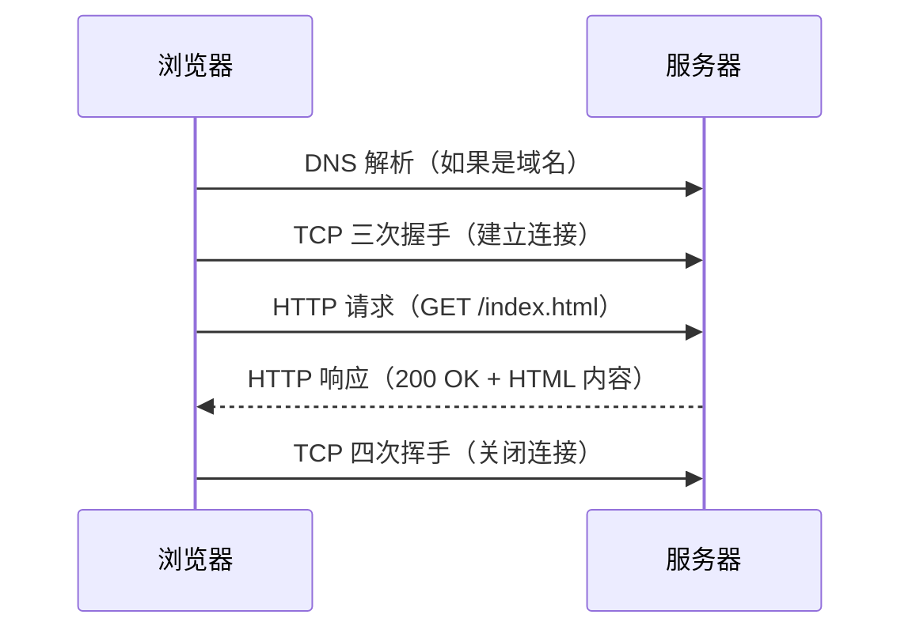
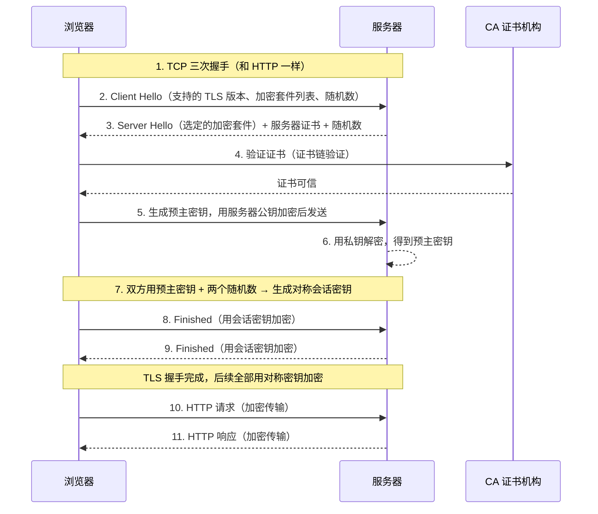
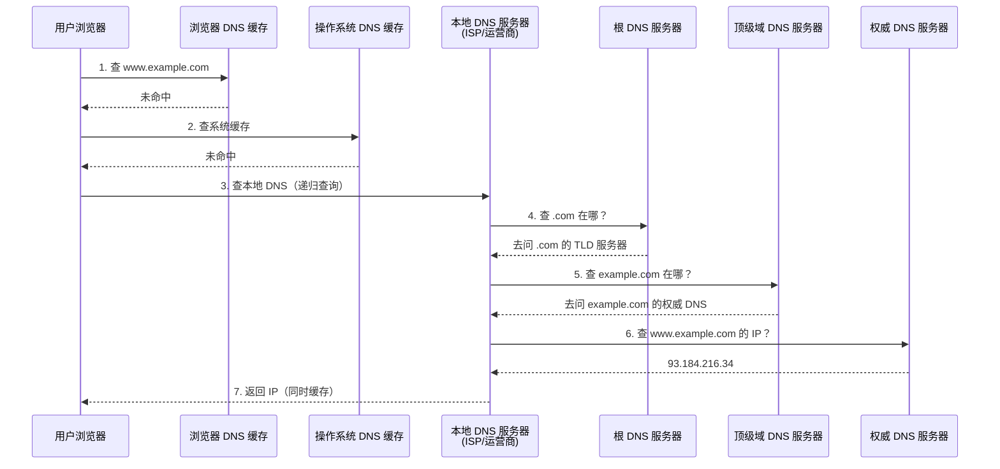
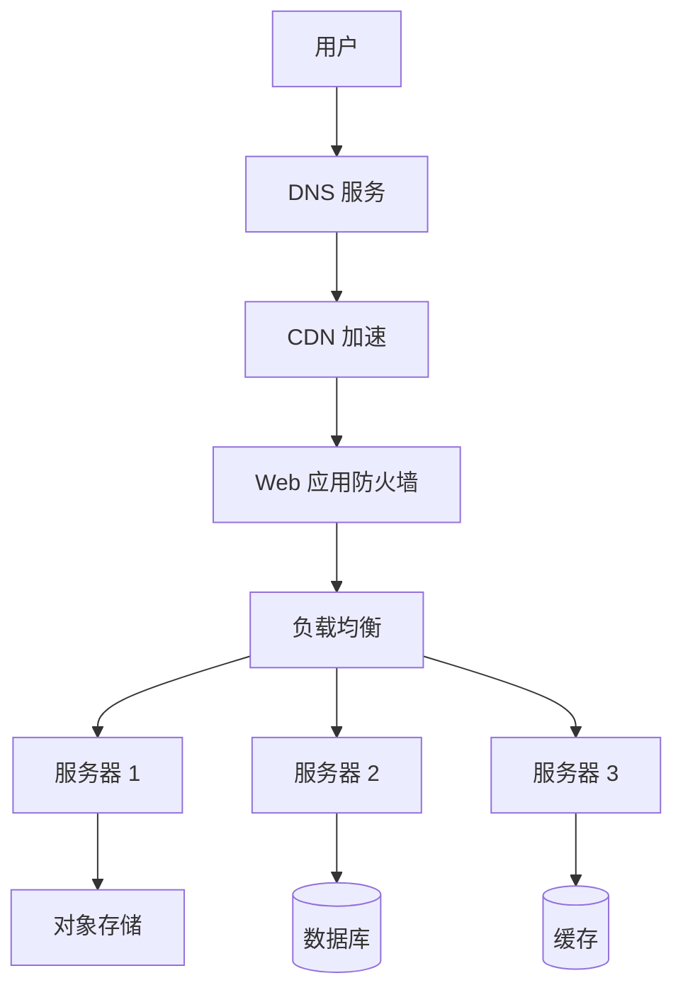

# 互联网访问全链路指南：HTTP、HTTPS、域名与云服务

> [!info] 概述
> 每天我们在浏览器输入一个地址，几毫秒到几百毫秒后页面就渲染出来了。这背后涉及 DNS 解析、TCP 连接、TLS 握手、HTTP 请求/响应等一系列精密协作。本文从一个开发者的视角，完整拆解这个过程，让你从「能用」到「懂为什么」。

## 目录

- [一、三种访问方式：你输入的到底是什么](#一三种访问方式你输入的到底是什么)
- [二、HTTP 协议详解](#二http-协议详解)
- [三、HTTPS 协议详解](#三https-协议详解)
- [四、域名访问的实现过程](#四域名访问的实现过程)
- [五、完整链路对比：三种访问方式发生了什么](#五完整链路对比三种访问方式发生了什么)
- [六、发展动机：为什么会有这些技术](#六发展动机为什么会有这些技术)
- [七、部署应用时需要考虑的云服务](#七部署应用时需要考虑的云服务)
- [常见问题](#常见问题)

---

## 一、三种访问方式：你输入的到底是什么

当你在浏览器地址栏输入内容时，浏览器会根据输入内容判断你要做什么：

| 输入内容 | 浏览器行为 | 示例 |
|---------|-----------|------|
| `http://192.168.1.100:8080` | 直接发起 HTTP 请求到该 IP 的 8080 端口 | 局域网调试 |
| `https://1.2.3.4` | 发起 HTTPS 请求（TLS 握手后 HTTP），默认端口 443 | 直接访问服务器 IP |
| `www.example.com` | 先 DNS 解析域名 → 得到 IP → 再发起 HTTPS（或 HTTP）请求 | 正常网页访问 |
| `example.com` | 同上，浏览器会自动补全协议（现代浏览器默认 HTTPS） | 正常网页访问 |

> [!tip] 浏览器的自动补全
> 现代浏览器（Chrome、Safari 等）在你只输入域名时，会自动尝试 HTTPS。如果 HTTPS 失败，才会降级到 HTTP。这叫 **HSTS 预加载列表**机制。

---

## 二、HTTP 协议详解

### 2.1 什么是 HTTP

HTTP（HyperText Transfer Protocol，超文本传输协议）是客户端（通常是浏览器）和服务器之间通信的规则。它定义了：

- 客户端怎么**请求**资源
- 服务器怎么**响应**资源
- 数据以什么**格式**传输

HTTP 是**无状态**协议——每个请求都是独立的，服务器不会自动记住你之前来过。

### 2.2 HTTP 的工作过程



#### 步骤拆解

**1. DNS 解析（如果输入的是域名）**

```
浏览器缓存 → 操作系统缓存 → 本地 DNS → 根 DNS → 顶级域 DNS → 权威 DNS
```

拿到 IP 地址后，才能进行下一步。

**2. TCP 三次握手（建立连接）**

```
客户端 → 服务器：SYN（你好，我要连你）
服务器 → 客户端：SYN + ACK（好的，我准备好了）
客户端 → 服务器：ACK（确认，开始通信）
```

> [!note] 为什么是三次
> 两次不够——服务器无法确认客户端收到了自己的回复。三次是确认双方都能收发的最小次数。

**3. 发送 HTTP 请求**

```http
GET /index.html HTTP/1.1
Host: www.example.com
User-Agent: Mozilla/5.0
Accept: text/html
Connection: keep-alive
```

| 组成部分 | 说明 |
|---------|------|
| 请求行 | `GET /index.html HTTP/1.1` — 方法 + 路径 + 版本 |
| 请求头 | `Host`、`User-Agent`、`Accept` 等元信息 |
| 空行 | 标识头部结束 |
| 请求体 | POST/PUT 时携带的数据，GET 没有请求体 |

**4. 服务器返回 HTTP 响应**

```http
HTTP/1.1 200 OK
Content-Type: text/html; charset=UTF-8
Content-Length: 1234
Cache-Control: max-age=3600

<!DOCTYPE html>
<html>
  <body>Hello World</body>
</html>
```

| 组成部分 | 说明 |
|---------|------|
| 状态行 | `HTTP/1.1 200 OK` — 版本 + 状态码 + 状态文本 |
| 响应头 | `Content-Type`、`Content-Length`、`Cache-Control` 等 |
| 空行 | 标识头部结束 |
| 响应体 | 实际返回的 HTML/JSON/图片等数据 |

### 2.3 HTTP 请求方法

| 方法 | 用途 | 幂等性 | 请求体 |
|------|------|--------|--------|
| `GET` | 获取资源 | 是 | 无 |
| `POST` | 创建资源 / 提交数据 | 否 | 有 |
| `PUT` | 全量更新资源 | 是 | 有 |
| `PATCH` | 部分更新资源 | 否 | 有 |
| `DELETE` | 删除资源 | 是 | 可选 |
| `HEAD` | 只获取头部（不拿内容） | 是 | 无 |
| `OPTIONS` | 查询支持的 method | 是 | 无 |

> [!note] 幂等性
> 幂等（Idempotent）意味着调用一次和调用多次效果相同。GET 是幂等的（读几次都一样），POST 不是（提交几次就创建几条）。

### 2.4 HTTP 状态码

| 范围 | 类别 | 常见状态码 |
|------|------|-----------|
| 1xx | 信息 | `100 Continue` |
| 2xx | 成功 | `200 OK`、`201 Created`、`204 No Content` |
| 3xx | 重定向 | `301 永久重定向`、`302 临时重定向`、`304 未修改` |
| 4xx | 客户端错误 | `400 Bad Request`、`401 Unauthorized`、`403 Forbidden`、`404 Not Found` |
| 5xx | 服务端错误 | `500 Internal Server Error`、`502 Bad Gateway`、`503 Service Unavailable` |

### 2.5 HTTP/1.0 vs HTTP/1.1 vs HTTP/2 vs HTTP/3

| 特性 | HTTP/1.0 | HTTP/1.1 | HTTP/2 | HTTP/3 |
|------|----------|----------|--------|--------|
| 连接复用 | ❌ 每次请求新建 TCP | ✅ Keep-Alive | ✅ 多路复用 | ✅ 多路复用 |
| 头部压缩 | ❌ | ❌ | ✅ HPACK | ✅ QPACK |
| 并发请求 | 需开多个 TCP | 管道化（有队头阻塞） | 单连接多流 | 单连接多流 |
| 传输层 | TCP | TCP | TCP | **UDP（QUIC）** |
| 服务器推送 | ❌ | ❌ | ✅ | ✅ |

> [!tip] HTTP/3 为什么用 UDP
> TCP 的队头阻塞问题（一个丢包卡住整条连接）在 HTTP/2 中依然存在。QUIC 基于 UDP 实现，每个流独立，一个流丢包不影响其他流。同时 QUIC 把 TLS 握手合并进连接建立，减少了延迟。

---

## 三、HTTPS 协议详解

### 3.1 为什么需要 HTTPS

HTTP 有三个根本性问题：

| 问题 | 说明 | 后果 |
|------|------|------|
| **明文传输** | 数据不加密，任何人都能截获 | 密码、Cookie 被窃取 |
| **不验证身份** | 无法确认服务器是谁 | 中间人攻击、钓鱼网站 |
| **数据可篡改** | 没有完整性校验 | 运营商注入广告、劫持页面 |

HTTPS = HTTP + TLS（Transport Layer Security），在 HTTP 之下加了一层加密通道。

### 3.2 HTTPS 的工作过程



### 3.3 TLS 握手核心步骤解读

#### 第一步：Client Hello

浏览器告诉服务器：
- 我支持哪些 TLS 版本（TLS 1.2、TLS 1.3）
- 我支持哪些加密套件（如 `AES_256_GCM`、`CHACHA20_POLY1305`）
- 一个客户端随机数

#### 第二步：Server Hello + 证书

服务器回复：
- 选定 TLS 版本和加密套件
- 发送**服务器证书**（包含公钥、域名、有效期、CA 签名）
- 一个服务器随机数

#### 第三步：证书验证

浏览器验证证书：
1. **证书链验证**：服务器证书 → 中间 CA → 根 CA，逐级验证签名
2. **域名匹配**：证书中的域名是否和访问的域名一致
3. **有效期检查**：证书是否过期
4. **吊销检查**：证书是否被吊销（CRL / OCSP）

> [!warning] 证书验证失败
> 如果任何一步验证失败，浏览器会显示警告页面。用户可以选择继续（不推荐），相当于信任了一个不受信任的证书。

#### 第四步：密钥交换

- 浏览器生成一个**预主密钥**（Pre-Master Secret）
- 用服务器证书中的**公钥**加密
- 发送给服务器
- 服务器用**私钥**解密

#### 第五步：生成会话密钥

双方用以下信息生成相同的**对称会话密钥**：
- 预主密钥
- 客户端随机数
- 服务器随机数

> [!note] 为什么不直接用非对称加密
> 非对称加密（RSA）慢，比对称加密慢几百倍。所以 TLS 只在握手阶段用非对称加密交换密钥，之后用对称加密传输数据。

### 3.4 TLS 1.2 vs TLS 1.3

| 特性 | TLS 1.2 | TLS 1.3 |
|------|---------|---------|
| 握手轮次 | 2 RTT | **1 RTT**（甚至 0-RTT 恢复） |
| 支持的密钥交换 | RSA、DH、ECDHE | **仅 ECDHE**（前向保密） |
| 加密套件 | 很多（含不安全的） | **5 个**（全部是 AEAD） |
| 安全性 | 依赖实现选择 | 默认安全 |

> [!tip] 前向保密（Forward Secrecy）
> 即使未来服务器的私钥泄露，历史通信也无法被解密。因为每次会话的密钥都是临时生成的 ECDHE 密钥对，不依赖长期私钥。

### 3.5 证书类型

| 类型 | 验证级别 | 适用场景 | 价格 |
|------|---------|---------|------|
| DV（Domain Validation） | 验证域名所有权 | 个人网站、测试 | 免费（Let's Encrypt） |
| OV（Organization Validation） | 验证组织真实性 | 企业官网 | 付费 |
| EV（Extended Validation） | 严格验证组织 | 金融、电商 | 付费（较贵） |

### 3.6 用 IP 直接访问 HTTPS 的问题

当你用 `https://1.2.3.4` 访问时：

1. TLS 握手时，证书里写的是**域名**，不是 IP
2. 浏览器会报证书域名不匹配的错误
3. 除非你专门申请了包含 IP 的证书（少见且昂贵）

> [!warning] HTTPS + IP 的局限
> 一般不建议用 IP 直接访问 HTTPS。正规做法是通过域名访问，证书绑定域名。

---

## 四、域名访问的实现过程

### 4.1 域名的层级结构

```
www.example.com.
 │     │       │  └── 根域（.，通常省略）
 │     │       └───── 顶级域（TLD）：.com
 │     └───────────── 二级域：example
 └─────────────────── 子域/主机名：www
```

| 层级 | 说明 | 示例 |
|------|------|------|
| 根域 | 全球 13 组根服务器 | `.` |
| 顶级域（TLD） | 分类域名 | `.com`、`.org`、`.cn`、`.dev` |
| 二级域 | 注册购买的域名 | `example.com` |
| 子域 | 自行配置 | `www.example.com`、`api.example.com` |

### 4.2 DNS 解析完整过程



#### 查询类型

| 类型 | 说明 | 特点 |
|------|------|------|
| **递归查询** | 客户端问本地 DNS，本地 DNS 负责最终给出答案 | 客户端只问一次 |
| **迭代查询** | 本地 DNS 依次问根 → TLD → 权威，每步得到「去问谁」的指引 | 本地 DNS 自己跑腿 |

> [!note] 实际体验
> 大多数情况下，本地 DNS（运营商提供的）已经有缓存，不需要完整走一遍。真正的完整解析只在缓存过期时才发生。

### 4.3 DNS 记录类型

| 记录类型 | 用途 | 示例 |
|---------|------|------|
| **A** | 域名 → IPv4 地址 | `example.com → 93.184.216.34` |
| **AAAA** | 域名 → IPv6 地址 | `example.com → 2606:2800:220:1:...` |
| **CNAME** | 域名别名 → 另一个域名 | `www.example.com → example.com` |
| **MX** | 邮件服务器 | `example.com → mail.example.com` |
| **NS** | 域名的 DNS 服务器 | `example.com → ns1.dnsprovider.com` |
| **TXT** | 文本记录（SPF、验证等） | `example.com → "v=spf1 include:..."` |
| **SRV** | 服务定位 | `_http._tcp.example.com → ...` |

### 4.4 实际操作：查看 DNS 解析过程

```bash
# 使用 dig 追踪完整解析过程
dig +trace www.example.com

# 查看特定类型的记录
dig example.com A        # IPv4 地址
dig example.com AAAA     # IPv6 地址
dig example.com MX       # 邮件记录
dig www.example.com CNAME # 别名

# 使用 nslookup（更简单）
nslookup www.example.com

# 清除本地 DNS 缓存（macOS）
sudo dscacheutil -flushcache
sudo killall -HUP mDNSResponder
```

---

## 五、完整链路对比：三种访问方式发生了什么

### 5.1 访问 `http://192.168.1.100:8080`

```
浏览器
  │
  ├─ 解析 URL：协议=http，IP=192.168.1.100，端口=8080
  │
  ├─ TCP 三次握手 → 192.168.1.100:8080
  │    SYN → SYN+ACK → ACK
  │
  ├─ 发送 HTTP 请求（明文）
  │    GET / HTTP/1.1
  │    Host: 192.168.1.100:8080
  │
  ├─ 接收 HTTP 响应（明文）
  │    HTTP/1.1 200 OK
  │    <html>...</html>
  │
  └─ 渲染页面
```

**特点**：最快、最简单、完全不安全。适合局域网开发调试。

### 5.2 访问 `https://1.2.3.4`

```
浏览器
  │
  ├─ 解析 URL：协议=https，IP=1.2.3.4，端口=443（默认）
  │
  ├─ TCP 三次握手 → 1.2.3.4:443
  │
  ├─ TLS 握手
  │    Client Hello → Server Hello + 证书
  │    → 验证证书（⚠️ 大概率报错：证书域名不匹配）
  │    → 密钥交换 → 生成会话密钥
  │
  ├─ 发送 HTTP 请求（加密）
  ├─ 接收 HTTP 响应（加密）
  │
  └─ 渲染页面
```

**特点**：加密但证书问题多，实践中不推荐用 IP 访问 HTTPS。

### 5.3 访问 `www.example.com`

```
浏览器
  │
  ├─ URL 解析：协议=自动（现代浏览器默认 https），域名=www.example.com
  │
  ├─ DNS 解析（查找 IP 地址）
  │    浏览器缓存 → 系统缓存 → 本地 DNS → 根 DNS → TLD DNS → 权威 DNS
  │    结果：www.example.com → 93.184.216.34
  │
  ├─ TCP 三次握手 → 93.184.216.34:443
  │
  ├─ TLS 握手
  │    Client Hello → Server Hello + 证书
  │    → 验证证书（✅ 域名匹配：www.example.com）
  │    → 密钥交换 → 生成会话密钥
  │
  ├─ 发送 HTTP 请求（加密）
  │    GET / HTTP/1.1
  │    Host: www.example.com
  │
  ├─ 接收 HTTP 响应（加密）
  │    HTTP/2 200 OK
  │    <html>...</html>
  │
  └─ 渲染页面
```

**特点**：完整链路，安全且规范。这是生产环境的标准做法。

### 5.4 三种方式对比

| 维度 | HTTP + IP | HTTPS + IP | 域名 |
|------|-----------|------------|-------|
| DNS 解析 | 不需要 | 不需要 | 需要 |
| TCP 握手 | 需要 | 需要 | 需要 |
| TLS 握手 | 不需要 | 需要 | 需要 |
| 证书验证 | 无 | ⚠️ 域名不匹配 | 正常 |
| 加密 | ❌ 明文 | ✅ 加密 | ✅ 加密 |
| 安全性 | 低 | 中 | 高 |
| 易记性 | 差 | 差 | 好 |
| 适用场景 | 本地开发 | 测试 | 生产环境 |

---

## 六、发展动机：为什么会有这些技术

### 6.1 时间线

```
1991  HTTP/0.9   只能传 HTML，只有 GET
  │
1996  HTTP/1.0   支持 POST/HEAD、状态码、Content-Type
  │               问题：每次请求新建 TCP 连接
  │
1997  HTTP/1.1   Keep-Alive 连接复用、管道化、Host 头
  │               问题：队头阻塞、头部冗余
  │
1994  SSL/HTTPS  网景发明 SSL，解决加密和身份验证
  │               动机：电商兴起，需要安全的在线支付
  │
1999  TLS 1.0    SSL 的标准化版本
  │
2000s CDN/云     Akamai、AWS 等兴起
  │               动机：全球用户需要就近访问
  │
2015  HTTP/2     多路复用、头部压缩、服务器推送
  │               动机：页面越来越复杂（上百个资源），HTTP/1.1 效率太低
  │
2018  TLS 1.3    1-RTT 握手、强制前向保密
  │               动机：TLS 1.2 握手太慢，且存在不安全的加密套件
  │
2022  HTTP/3     基于 QUIC（UDP），解决 TCP 队头阻塞
  │               动机：移动网络切换 IP 时 TCP 要重新连接，QUIC 不需要
```

### 6.2 核心动机总结

| 技术 | 解决什么问题 | 为什么需要 |
|------|-------------|-----------|
| **HTTP** | 互联网上交换超文本 | 没有统一协议，浏览器和服务器无法对话 |
| **HTTP/1.1** | 连接复用 | HTTP/1.0 每个请求都建 TCP 连接，慢且浪费资源 |
| **HTTP/2** | 并发传输效率 | 现代网页有几百个资源，HTTP/1.1 管道化有队头阻塞 |
| **HTTP/3** | 弱网和移动场景 | TCP 一个丢包卡住所有流，QUIC 基于无连接 UDP 解决 |
| **SSL/TLS** | 传输安全 | 明文传输可被窃听、篡改、伪造 |
| **TLS 1.3** | 握手效率和安全 | TLS 1.2 握手 2-RTT 太慢，且存在已知漏洞的算法 |
| **DNS** | 人类友好的地址 | IP 地址记不住，域名更好记 |
| **CDN** | 全球加速 | 用户和服务器物理距离远，延迟高 |

---

## 七、部署应用时需要考虑的云服务

### 7.1 全景图



### 7.2 各层云服务详解

#### 第 1 层：域名注册与 DNS

| 服务 | 作用 | 主流选择 |
|------|------|---------|
| **域名注册商** | 购买域名 | Namecheap、GoDaddy、阿里云、腾讯云 |
| **DNS 托管** | 管理 DNS 记录 | Cloudflare、AWS Route 53、阿里云 DNS、DNSPod |

> [!tip] 最佳实践
> 域名注册和 DNS 托管可以分开。推荐用 Cloudflare 做 DNS 托管——免费、快、还自带 CDN 和基础 DDoS 防护。

#### 第 2 层：CDN（内容分发网络）

| 特性 | 说明 |
|------|------|
| **作用** | 把静态资源（图片、JS、CSS）缓存在全球边缘节点 |
| **原理** | 用户就近访问边缘节点，不需要请求源服务器 |
| **适用** | 静态资源、大文件下载、视频流、API 加速 |

| 服务商 | 特点 |
|--------|------|
| Cloudflare | 免费计划可用，全球覆盖，配置简单 |
| AWS CloudFront | 深度集成 AWS 生态 |
| 阿里云 CDN | 国内节点多，备案后效果好 |
| 腾讯云 CDN | 国内常用，有免费额度 |

#### 第 3 层：SSL/TLS 证书

| 方案 | 特点 |
|------|------|
| **Let's Encrypt** | 免费、自动续期、90 天有效期 |
| **Cloudflare** | 免费 Universal SSL，自动管理 |
| **云服务商** | 阿里云/腾讯云提供免费 DV 证书 |
| **付费 CA** | DigiCert、Sectigo（OV/EV 证书） |

```bash
# 使用 certbot 自动获取和续期 Let's Encrypt 证书
sudo certbot --nginx -d example.com -d www.example.com

# 自动续期（certbot 会自动添加 cron）
sudo certbot renew --dry-run
```

#### 第 4 层：WAF（Web 应用防火墙）

| 防护类型 | 说明 |
|---------|------|
| SQL 注入 | 拦截恶意 SQL 语句 |
| XSS 攻击 | 拦截跨站脚本 |
| DDoS 防护 | 缓解大规模流量攻击 |
| Bot 防护 | 拦截恶意爬虫 |
| CC 攻击 | 防止高频请求刷爆服务器 |

| 服务商 | 特点 |
|--------|------|
| Cloudflare WAF | 免费基础防护，付费版规则更细 |
| AWS WAF | 按 rule 收费，灵活 |
| 阿里云 WAF | 国内合规友好 |

#### 第 5 层：负载均衡

| 类型 | 说明 | 典型产品 |
|------|------|---------|
| **四层（L4）** | 基于 IP + 端口转发 TCP/UDP | AWS NLB、阿里云 SLB（四层） |
| **七层（L7）** | 基于 HTTP 头/路径/域名转发 | AWS ALB、Nginx、阿里云 SLB（七层） |

```nginx
# Nginx 七层负载均衡配置示例
upstream backend {
    server 10.0.0.1:8080;
    server 10.0.0.2:8080;
    server 10.0.0.3:8080;
}

server {
    listen 443 ssl;
    server_name example.com;

    ssl_certificate     /etc/ssl/certs/example.pem;
    ssl_certificate_key /etc/ssl/private/example.key;

    location / {
        proxy_pass http://backend;
        proxy_set_header Host $host;
        proxy_set_header X-Real-IP $remote_addr;
        proxy_set_header X-Forwarded-For $proxy_add_x_forwarded_for;
        proxy_set_header X-Forwarded-Proto $scheme;
    }
}
```

#### 第 6 层：计算资源

| 类型 | 特点 | 适用场景 |
|------|------|---------|
| **虚拟机（VPS）** | 完整 OS 控制 | 通用、灵活 |
| **容器（K8s）** | 轻量、弹性扩缩 | 微服务架构 |
| **Serverless** | 按调用计费，无需管服务器 | API、事件驱动 |
| **PaaS** | 托管运行时 | 快速部署 |

| 服务商 | 产品 |
|--------|------|
| AWS | EC2（VM）、ECS/EKS（容器）、Lambda（Serverless）、Elastic Beanstalk（PaaS） |
| 阿里云 | ECS（VM）、ACK（容器）、函数计算（Serverless） |
| 腾讯云 | CVM（VM）、TKE（容器）、云函数（Serverless） |
| Vercel / Netlify | 前端 PaaS，自动 CI/CD + 全球 CDN |
| Railway / Fly.io | 全栈 PaaS，简单易用 |

#### 第 7 层：存储与数据库

| 类型 | 说明 | 典型产品 |
|------|------|---------|
| **对象存储** | 文件、图片、备份 | AWS S3、阿里云 OSS、Cloudflare R2 |
| **块存储** | 虚拟机硬盘 | AWS EBS、阿里云云盘 |
| **关系数据库** | 结构化数据 | AWS RDS、阿里云 RDS、PlanetScale |
| **NoSQL** | 非结构化/文档 | AWS DynamoDB、MongoDB Atlas |
| **Redis 缓存** | 高速缓存/会话 | AWS ElastiCache、阿里云 Redis |
| **CDN 存储** | 静态资源 | 已集成在 CDN 中 |

### 7.3 不同规模的部署方案

#### 个人项目 / 学习

```
用户 → Cloudflare（DNS + CDN + 免费 SSL + WAF）
     → VPS（如 AWS Lightsail / 阿里云 ECS / Hetzner）
        → Nginx + 应用 + SQLite/PostgreSQL
```

**月成本**：$5-20

#### 中小型项目

```
用户 → Cloudflare / 阿里云 CDN
     → 云负载均衡
        → 2-3 台 ECS/EC2（Nginx + 应用）
        → RDS（托管数据库）
        → Redis（缓存）
        → OSS/S3（文件存储）
```

**月成本**：$50-500

#### 生产级应用

```
用户 → Cloudflare Enterprise / 自建 CDN
     → WAF
     → 云负载均衡（多区域）
        → K8s 集群（自动扩缩容）
        → RDS 主从 + 读写分离
        → Redis 集群
        → OSS/S3 + CDN
        → 日志服务 + 监控告警
```

**月成本**：$500+

### 7.4 国内 vs 海外部署考量

| 维度 | 国内（阿里云/腾讯云） | 海外（AWS/GCP/Cloudflare） |
|------|---------------------|--------------------------|
| **ICP 备案** | 必须（否则域名被拦截） | 不需要 |
| **速度** | 国内用户快 | 海外用户快 |
| **合规** | 数据出境限制 | GDPR 等海外合规 |
| **成本** | 中等 | 灵活（按量付费） |
| **域名** | 需要备案后才能解析 | 即买即用 |

> [!warning] ICP 备案
> 如果你的服务器在中国大陆，域名**必须完成 ICP 备案**才能使用。未备案域名会被云服务商拦截。备案通常需要 1-3 周。使用海外服务器则无需备案。

---

## 常见问题

### Q1: 为什么有时候用 IP 能访问，用域名不行？

检查以下几项：
1. DNS 解析是否正确（`dig your-domain.com`）
2. 域名是否完成备案（国内服务器）
3. 服务器是否配置了 `Host` 头检查（虚拟主机）
4. 证书是否覆盖该域名

### Q2: HTTP 能访问但 HTTPS 不行？

```bash
# 检查 443 端口是否开放
curl -v https://your-domain.com

# 检查证书
openssl s_client -connect your-domain.com:443 -servername your-domain.com

# 检查 Nginx 配置
nginx -t
```

常见原因：
- 443 端口未在安全组/防火墙放行
- SSL 证书过期或配置错误
- Nginx/Apache 未配置 HTTPS 虚拟主机

### Q3: 怎么从 HTTP 迁移到 HTTPS？

1. **获取证书**（Let's Encrypt / Cloudflare）
2. **配置 Web 服务器**（Nginx/Apache 添加 SSL 配置）
3. **设置 HTTP → HTTPS 重定向**
4. **启用 HSTS**（告诉浏览器以后只走 HTTPS）
5. **更新应用中的硬编码链接**

```nginx
# HTTP → HTTPS 重定向
server {
    listen 80;
    server_name example.com www.example.com;
    return 301 https://$host$request_uri;
}
```

### Q4: HTTP/2 和 HTTP/3 需要怎么配置？

- **HTTP/2**：Nginx 1.9.5+ 加 `http2 on` 即可，大多数云 CDN 默认支持
- **HTTP/3**：需要 Nginx 1.25.0+ 或 Cloudflare（默认支持）

```nginx
# Nginx 启用 HTTP/2
server {
    listen 443 ssl;
    http2 on;
    # ...
}
```

### Q5: 一个服务器怎么部署多个域名？

通过**虚拟主机**（Virtual Host）实现，Nginx/Apache 根据 `Host` 头将请求分发到不同的应用：

```nginx
# 域名 A
server {
    listen 443 ssl;
    server_name app-a.com;
    ssl_certificate /etc/ssl/app-a.pem;
    ssl_certificate_key /etc/ssl/app-a.key;
    location / { proxy_pass http://127.0.0.1:3000; }
}

# 域名 B
server {
    listen 443 ssl;
    server_name app-b.com;
    ssl_certificate /etc/ssl/app-b.pem;
    ssl_certificate_key /etc/ssl/app-b.key;
    location / { proxy_pass http://127.0.0.1:4000; }
}
```

### Q6: Cloudflare 橙色云朵是什么意思？

Cloudflare 的代理模式：
- **橙色云朵（Proxied）**：流量经过 Cloudflare，享受 CDN + WAF + 隐藏源站 IP
- **灰色云朵（DNS Only）**：只做 DNS 解析，流量直连你的服务器

---

## 参考资源

- [MDN: HTTP 概述](https://developer.mozilla.org/zh-CN/docs/Web/HTTP/Overview)
- [MDN: HTTP/2](https://developer.mozilla.org/zh-CN/docs/Glossary/HTTP_2)
- [RFC 9110: HTTP Semantics](https://www.rfc-editor.org/rfc/rfc9110)
- [RFC 8446: TLS 1.3](https://www.rfc-editor.org/rfc/rfc8446)
- [RFC 9000: QUIC](https://www.rfc-editor.org/rfc/rfc9000)
- [Let's Encrypt 官方文档](https://letsencrypt.org/docs/)
- [Cloudflare 学习中心](https://www.cloudflare.com/learning/)

